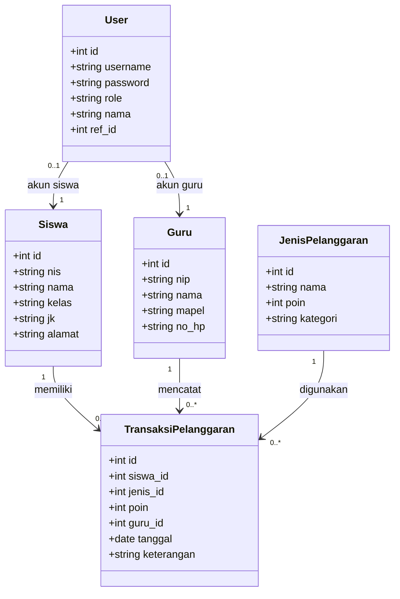
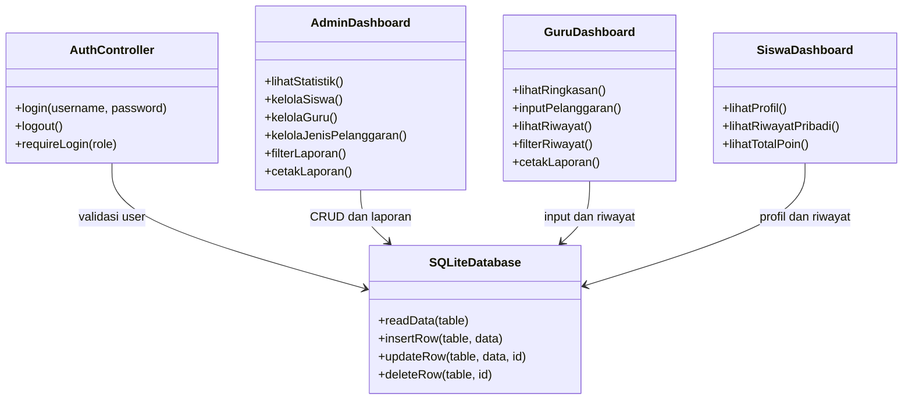

# Diagram Class Sistem Informasi Pelanggaran Siswa

## 1. Diagram Class Domain Data

```mermaid
classDiagram
    class User {
        +int id
        +string username
        +string password
        +string role
        +string nama
        +int ref_id
    }

    class Siswa {
        +int id
        +string nis
        +string nama
        +string kelas
        +string jk
        +string alamat
    }

    class Guru {
        +int id
        +string nip
        +string nama
        +string mapel
        +string no_hp
    }

    class JenisPelanggaran {
        +int id
        +string nama
        +int poin
        +string kategori
    }

    class TransaksiPelanggaran {
        +int id
        +int siswa_id
        +int jenis_id
        +int poin
        +int guru_id
        +date tanggal
        +string keterangan
    }

    Siswa "1" --> "0..*" TransaksiPelanggaran : memiliki
    Guru "1" --> "0..*" TransaksiPelanggaran : mencatat
    JenisPelanggaran "1" --> "0..*" TransaksiPelanggaran : digunakan
    User "0..1" --> "1" Siswa : akun siswa
    User "0..1" --> "1" Guru : akun guru
```

## 2. Diagram Class Fitur dan Hak Akses

```mermaid
classDiagram
    class AuthController {
        +login(username, password)
        +logout()
        +requireLogin(role)
    }

    class AdminDashboard {
        +lihatStatistik()
        +kelolaSiswa()
        +kelolaGuru()
        +kelolaJenisPelanggaran()
        +filterLaporan()
        +cetakLaporan()
    }

    class GuruDashboard {
        +lihatRingkasan()
        +inputPelanggaran()
        +lihatRiwayat()
        +filterRiwayat()
        +cetakLaporan()
    }

    class SiswaDashboard {
        +lihatProfil()
        +lihatRiwayatPribadi()
        +lihatTotalPoin()
    }

    class SQLiteDatabase {
        +readData(table)
        +insertRow(table, data)
        +updateRow(table, data, id)
        +deleteRow(table, id)
    }

    AuthController --> SQLiteDatabase : validasi user
    AdminDashboard --> SQLiteDatabase : CRUD dan laporan
    GuruDashboard --> SQLiteDatabase : input dan riwayat
    SiswaDashboard --> SQLiteDatabase : profil dan riwayat
```
